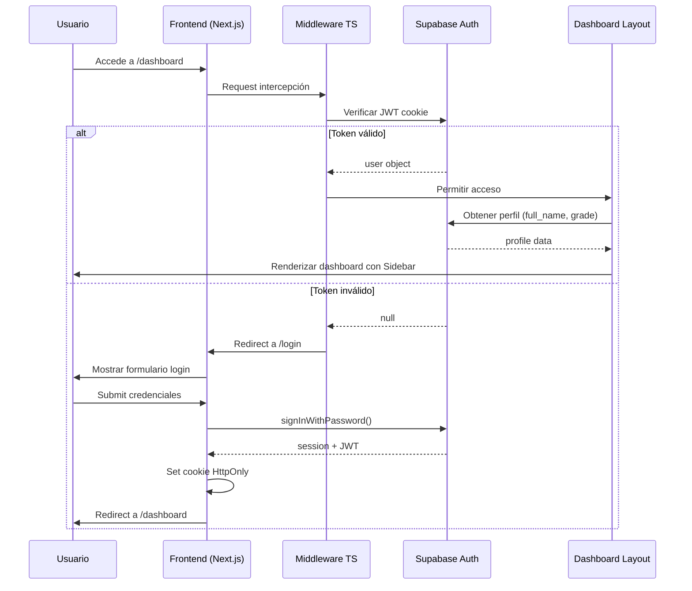
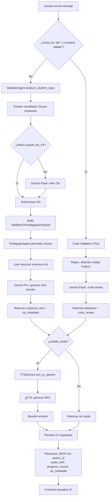
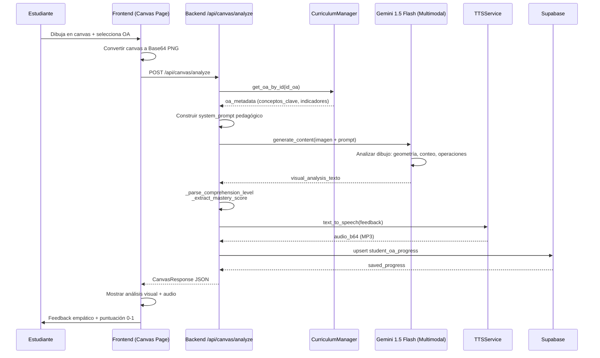

# AUDITORÍA TÉCNICA COMPLETA: SUPER PROFESOR
**Fecha**: 2026-06-22  
**Auditor**: Arquitecto de Software Senior & Experto en IA  
**Alcance**: Revisión end-to-end del proyecto "Super Profesor"

---

## 1. REVISIÓN DE ARQUITECTURA Y ESTADO ACTUAL

### 1.1 Estructura General del Proyecto

```
xprize/
├── backend/                    # API REST en FastAPI (Python)
│   ├── app/
│   │   ├── agents/            # Sistema multi-agente (orquestador, validador, pedagógico)
│   │   ├── api/               # Endpoints adicionales (analytics)
│   │   ├── models/            # Esquemas Pydantic + conexión Supabase
│   │   ├── routers/           # Routers FastAPI (curriculum, governance, tts)
│   │   └── services/          # Servicios core (Gemini, TTS, DynamicLoader, Curriculum)
│   ├── scripts/               # Scripts de seeding y testing
│   └── requirements.txt       # Dependencias Python
├── frontend/                  # App Next.js 14 (App Router + TypeScript)
│   ├── app/                   # Rutas de Next.js
│   │   ├── (auth)/           # Flujo de autenticación (login/register)
│   │   ├── dashboard/        # Panel principal con páginas: chat, pizarra, progreso
│   │   └── api/              # API routes si aplica
│   ├── lib/                  # Utilidades (Supabase client)
│   ├── middleware.ts         # Auth middleware para Supabase
│   ├── next.config.js        # Config Next.js
│   └── package.json          # Dependencias Node
├── supabase/                 # Migraciones SQL de Supabase
├── curriculo_integrado.json  # Dataset curricular MINEDUC (1° a 8° básico)
├── docker-compose.yml        # Orquestación de servicios
└── .env.example             # Variables de entorno requeridas
```

### 1.2 Stack Tecnológico

| Capa | Tecnología | Versión | Propósito |
|------|-----------|---------|-----------|
| **Frontend** | Next.js 14 | 14.2.3 | Framework React con App Router |
| | TypeScript | 5.4.5 | Tipado estático |
| | Tailwind CSS | 3.4.3 | Estilos utility-first |
| | Framer Motion | 12.40.0 | Animaciones |
| | Recharts | 2.12.7 | Gráficos de progreso |
| | Monaco Editor | 4.6.0 | Editor de código para code review |
| | Supabase JS | 2.43.4 | Cliente BD y Auth |
| **Backend** | FastAPI | >=0.110.0 | API REST asíncrona |
| | Python 3.x | - | Lenguaje backend |
| | Pydantic v2 | >=2.6.0 | Validación de datos |
| | Google Gemini | 1.5 Flash/Pro | LLM principal |
| | gTTS | 2.4.0 | Text-to-Speech |
| | Supabase-py | >=2.4.0 | Cliente Python BD |
| **Infra** | Docker Compose | 3.9 | Contenedores |
| | Supabase | Cloud | PostgreSQL + Auth + Realtime |

### 1.3 Componentes Implementados

✅ **Backend Funcional**:
- API multi-agente con FastAPI
- Orquestación MasterOrchestrator (ruteo a ValidatorAgent/PedagogicAgent)
- Integración Gemini (texto + multimodal canvas)
- Servicio TTS con gTTS
- Gestión curricular MINEDUC (carga desde JSON/Supabase)
- Sistema de herramientas dinámicas (DynamicLoader con exec en caliente)
- Router de gobernanza HITL (Human-in-the-loop) para aprobación de herramientas
- Endpoints de progreso estudiantil

✅ **Frontend Funcional**:
- Next.js 14 con App Router y TypeScript
- Sistema de autenticación completo (login/register/callback)
- Middleware de protección de rutas con Supabase Auth
- Dashboard con Sidebar responsive
- Página de chat con historial
- Página de pizarra (canvas) para análisis visual
- Página de progreso con gráficos Recharts
- Perfil de usuario

✅ **Datos y Configuración**:
- Currículo integrado JSON con proyectos pedagógicos 1° a 8° básico
- Variables de entorno documentadas (.env.example)
- Docker Compose para despliegue

### 1.4 Flujo General de la Aplicación

```
Estudiante → Frontend (Next.js)
    ↓
API Request → Backend (FastAPI)
    ↓
MasterOrchestrator.route()
    ↓
├── ¿Code validation? → ValidatorAgent (directo a Gemini)
└── ¿Consulta pedagógica? → ValidatorAgent → PedagogicAgent → Gemini
    ↓
Respuesta + Audio TTS + Persistencia Supabase
    ↓
Frontend renderiza respuesta + actualiza progreso
```

### 1.5 Estado del Proyecto

🔵 **En desarrollo activo** - Arquitectura funcional pero requiere ajustes críticos antes de producción.

**Puntos fuertes**:
- Arquitectura limpia y escalable
- Separación de responsabilidades (agents, services, routers)
- Uso de Pydantic para validación estricta
- Alineación curricular oficial MINEDUC
- Soporte multimodal (canvas visual)

**Debilidades críticas**:
- Vulnerabilidad RCE en DynamicLoader
- Inconsistencias en formato de IDs y datos
- Manejo de errores silencioso
- Falta logging estructurado

---

## 2. DETECCIÓN Y RESOLUCIÓN DE ERRORES (BUG HUNTING)

### 2.1 Vulnerabilidad Crítica: Remote Code Execution (RCE)

#### 🔴 [CRÍTICO] `backend/app/services/dynamic_loader.py`

**Problema**: Uso de `exec()` sin sandbox para cargar código arbitrario desde Supabase. Cualquier usuario con permisos de escritura en la tabla `dynamic_tools` puede ejecutar código Python en el servidor.

```python
# ❌ VULNERABLE
exec(compiled_code, module.__dict__)
```

**Solución**: Implementar un sandbox con restricciones de seguridad.

```python
# ✅ SEGURO
import ast
import types
from typing import Dict, Callable

class SafeDynamicLoader:
    """Loader con validación de seguridad para código dinámico."""
    
    # Módulos permitidos (whitelist estricta)
    ALLOWED_IMPORTS = {
        'math', 'datetime', 'typing', 'collections',
        'json', 're', 'statistics'
    }
    
    # Operadores prohibidos (blacklist)
    FORBIDDEN_NODES = (
        ast.ImportFrom, ast.Expr, ast.Call,
        ast.Global, ast.Nonlocal, ast.Lambda,
    )

    @classmethod
    def validate_code(cls, code_str: str) -> bool:
        """Valida que el código no contiene operaciones peligrosas."""
        try:
            tree = ast.parse(code_str)
            for node in ast.walk(tree):
                # Bloquear imports no permitidos
                if isinstance(node, ast.Import):
                    for alias in node.names:
                        module = alias.name.split('.')[0]
                        if module not in cls.ALLOWED_IMPORTS:
                            raise ValueError(f"Import no permitido: {module}")
                
                # Bloquear nested functions y lambdas
                if isinstance(node, ast.FunctionDef):
                    for child in ast.walk(node):
                        if isinstance(child, (ast.Lambda, ast.Nonlocal)):
                            raise ValueError("Código no permitido: funciones anidadas o nonlocal")
                
                # Bloquear acceso a dunder methods peligrosos
                if isinstance(node, ast.Attribute):
                    if node.attr.startswith('__') and node.attr not in ('__name__', '__doc__'):
                        raise ValueError(f"Acceso a atributo peligroso: {node.attr}")
            
            return True
        except SyntaxError as e:
            raise ValueError(f"Error de sintaxis: {e}")

    @classmethod
    def load_tool_from_code(cls, code_str: str, tool_name: str) -> Callable:
        """Carga herramienta con validación de seguridad previa."""
        # 1. Validar seguridad
        cls.validate_code(code_str)
        
        # 2. Crear módulo con globals restringidos
        module = types.ModuleType(f"app.dynamic_tools.{tool_name}")
        module.__file__ = f"<dynamic_tool:{tool_name}>"
        
        # 3. Ejecutar en namespace aislado
        safe_globals = {
            '__builtins__': {
                'print': print,
                'len': len,
                'str': str,
                'int': int,
                'float': float,
                'bool': bool,
                'list': list,
                'dict': dict,
                'tuple': tuple,
                'set': set,
                'range': range,
                'enumerate': enumerate,
                'zip': zip,
                'map': map,
                'filter': filter,
                'sum': sum,
                'min': min,
                'max': max,
                'abs': abs,
                'round': round,
                'sorted': sorted,
                'isinstance': isinstance,
                'type': type,
            }
        }
        
        compiled_code = compile(code_str, filename=module.__file__, mode="exec")
        exec(compiled_code, safe_globals, module.__dict__)
        
        # ... resto del código original
```

**Impacto**: Crítico. Permite RCE en el servidor.

---

### 2.2 Inconsistencia en Formato de OA IDs

#### 🟠 [ALTO] `backend/app/agents/validator_agent.py`

**Problema**: El validador busca `oa_[0-9]{1,3}` (minúsculas) pero el currículo usa `OA_XX` (mayúsculas). Además, el índice usa formato `{id_oa}|{curso}|{asignatura}` pero `_filter_oas_by_course_subject` busca solo por `id_oa` alone.

```python
# ❌ INCONSISTENTE
explicit_match = re.findall(r"\b(oa_[0-9]{1,3})\b", normalized)  # minúsculas
for oa_id in explicit_match:
    if oa_id.upper() in candidate_oas:  # convierte a mayúsculas después
        candidates.append(oa_id.upper())
```

**Solución**:

```python
# ✅ CORRECTO
def _extract_candidate_oa_ids(
    self, student_message: str, curso: str, asignatura: str
) -> List[str]:
    normalized = self._normalize(student_message)
    candidate_oas = self._filter_oas_by_course_subject(curso, asignatura)
    
    # Buscar tanto OA_01 como oa_01
    explicit_match = re.findall(r"\b(OA_[0-9]{1,3})\b", normalized, re.IGNORECASE)
    candidates: List[str] = []
    
    for oa_id in explicit_match:
        oa_id_upper = oa_id.upper()
        if oa_id_upper in candidate_oas:
            candidates.append(oa_id_upper)
    
    # ... resto del método
```

**Impacto**: Alto. OA matching falla silenciosamente, forzando fallback a Gemini constantemente.

---

### 2.3 Mismatch de Formato en Historial de Chat

#### 🟡 [MEDIO] `backend/app/main.py` + `backend/app/services/gemini_client.py`

**Problema**: El endpoint `/api/chat` recupera historial desde Supabase con campo `content`, pero `generate_pedagogic_response` espera campo `text`.

```python
# main.py línea 148-153
history_res = supabase_client.table("chat_messages") \
    .select("role, content") \  # ← campo "content" desde BD
    .eq("session_id", session_id) \
    .order("timestamp", desc=True) \
    .limit(6) \
    .execute()
history = history_res.data[::-1] if history_res.data else []

# gemini_client.py línea 56-59
for turn in history:
    role = turn.get("role", "user").upper()
    text = turn.get("text", "")  # ← espera "text", pero llega "content"
    contents.append(f"{role}: {text}")
```

**Solución**:

```python
# Opción 1: Estandarizar en main.py
history = [
    {"role": msg["role"], "text": msg["content"]} 
    for msg in history_res.data
] if history_res.data else []

# Opción 2: Estandarizar en gemini_client.py
text = turn.get("text") or turn.get("content", "")
```

**Impacto**: Medio. Historial se envía vacío a Gemini, perdiendo contexto conversacional.

---

### 2.4 Manejo de Errores Silencioso

#### 🟡 [MEDIO] Múltiples archivos

**Problema**: Uso excesivo de `except Exception: pass` que oculta fallos críticos.

```python
# main.py líneas 142-143, 154-155, 184-185
except Exception:
    pass  # Tabla no existe, modo sin persistencia
```

**Solución**:

```python
# ✅ CORRECTO - Logging estructurado
import logging
logger = logging.getLogger(__name__)

except Exception as e:
    logger.warning(f"No se pudo recuperar sesión {session_id}: {str(e)}")
    # Continuar en modo degraded (sin persistencia)
```

**Impacto**: Medio. Dificulta debugging en producción.

---

### 2.5 Validación Insuficiente en CurriculumManager

#### 🟡 [MEDIO] `backend/app/services/curriculum_manager.py`

**Problema**: Acceso directo a `self._oa_index[oa_id]` sin validar existencia, causando KeyError.

```python
# ❌ lines 140, 170
raw_oa = self.curriculum_manager._oa_index.get(oa_id)  # Bien, usa .get()
# ...
oa_data = self.curriculum_manager._oa_index[oa_id]  # Mal, acceso directo sin validar
```

**Solución**:

```python
# ✅ CORRECTO
def _build_validation_payload(self, ...):
    raw_oa = self.curriculum_manager._oa_index.get(oa_id)
    if not raw_oa:
        raise ValueError(f"OA no encontrado: {oa_id}")
    # ... continuar
```

**Impacto**: Medio. Puede causar crash 500 en producción.

---

### 2.6 Credenciales Hardcodeadas

#### 🟠 [ALTO] `xprize/backend/app/services/curriculum_manager.py`

**Problema**: API key hardcodeada como fallback.

```python
# ❌ LÍNEA 26
api_key = os.getenv("GEMINI_API_KEY", "dummy-key")  # Fallback peligroso
```

**Solución**:

```python
# ✅ CORRECTO
api_key = os.getenv("GEMINI_API_KEY")
if not api_key:
    raise RuntimeError("GEMINI_API_KEY no configurada. Verifica tu archivo .env")
```

**Impacto**: Alto. Puede causar errores confusos en producción.

---

### 2.7 Modelos Pydantic Inconsistentes

#### 🟡 [MEDIO] `backend/app/models/schemas.py`

**Problema**: ChatResponse define `audio_response_b64` pero `/api/chat` retorna `audio_response_b64` (correcto), sin embargo hay campos inconsistentes.

**Solución**:

```python
# ✅ CORRECTO - Alinear con lo que retorna /api/chat
class ChatResponse(BaseModel):
    agent: str
    student_id: str
    session_id: Optional[str] = None  # ← Agregar
    response_text: str = Field(..., alias="response_text")  # ← Corregir nombre
    oa_metadata: Dict[str, Any]
    audio_response_b64: Optional[str] = None
    audio_mime_type: Optional[str] = None
    progress_record: Dict[str, Any]
    code_review: Optional[Dict[str, Any]] = None  # ← Agregar
    saved_progress: Optional[Dict[str, Any]] = None
```

**Impacto**: Bajo. Validación Pydantic puede fallar en documentación automática.

---

## 3. DIAGRAMACIÓN DE FLUJOS (FORMATO MERMAID)

### 3.1 Flujo de Autenticación y Acceso



---

### 3.2 Flujo de Chat Multi-Agente



---

### 3.3 Flujo de Análisis de Canvas (Pizarra)



---

### 3.4 Flujo de Gobierno y Herramientas Dinámicas

```mermaid
graph TD
    A[EvolutionEngine] -->|Genera código| B{Tabla: tool_approvals}
    B -->|status: pending| C[Admin/Profesor revisa]
    C --> D{¿Aprobar?}
    
    D -->|No| E[Actualizar status: rejected]
    D -->|Sí| F[Insertar en dynamic_tools]
    F --> G[DynamicLoader.load_tool_from_code]
    G --> G1[Validar AST (seguridad)]
    G1 --> G2[Compilar y exec en namespace aislado]
    G2 --> G3[Registrar en _loaded_tools]
    
    E --> H[Fin]
    G3 --> I[Router API puede invocar tool]
    
    J[Startup Backend] --> K[DynamicLoader.load_all_active_tools]
    K --> L[Query: SELECT * FROM dynamic_tools]
    L --> M[Precargar herramientas en memoria]
```

---

### 3.5 Flujo de Carga Curricular

```mermaid
graph TD
    A[CurriculumManager.__init__] --> B{¿Supabase configurado?}
    B -->|Sí| C[_load_curriculum_from_supabase]
    C --> C1[Query: SELECT * FROM curriculum_units]
    C1 --> C2[Query: SELECT * FROM curriculum_objectives]
    C2 --> C3[Join objectives → units]
    B -->|No| D{¿Archivo JSON existe?}
    
    D -->|malla_curricular_produccion.json| E[_convert_flat_to_units]
    E --> E1[Agrupar por curso|asignatura|eje]
    E1 --> E2[Construir objetivos_aprendizaje]
    
    D -->|curriculum_data.json| F[Load legacy JSON]
    
    C3 --> G[_build_oa_index]
    E2 --> G
    F --> G
    
    G --> G1[índice: {oa_id}|{curso}|{asignatura}]
    G1 --> H[Routers usan get_oa_by_id/search_oa_by_course]
```

---

## 4. RECOMENDACIONES ADICIONALES

### 4.1 Prioridades de Refactorización

| Prioridad | Acción | Archivo | Impacto |
|-----------|--------|---------|---------|
| **P0** | Implementar sandbox en DynamicLoader | `dynamic_loader.py` | 🔴 Crítico |
| **P0** | Corregir formato OA IDs | `validator_agent.py` | 🔴 Crítico |
| **P1** | Agregar logging estructurado | Todos | 🟠 Alto |
| **P1** | Estandarizar formato historial chat | `main.py` + `gemini_client.py` | 🟠 Alto |
| **P2** | Remover fallback "dummy-key" | `curriculum_manager.py` | 🟡 Medio |
| **P2** | Alinear schemas Pydantic con responses | `schemas.py` | 🟡 Medio |
| **P2** | Agregar tests unitarios | `/tests` | 🟡 Medio |

### 4.2 Mejoras de Seguridad

1. **Rate limiting** en `/api/chat` y `/api/canvas/analyze` (previene abuso de Gemini API)
2. **Validación de tamaño** en `canvas_data` (limitar a 5MB)
3. **CORS**: Remover `"*"` en `allow_methods` y `allow_headers` para producción
4. **Variables de entorno**: Nunca loggear valores de API keys
5. **HTTPS obligatorio** en producción (actualmente permite HTTP en desarrollo)

### 4.3 Optimizaciones de Performance

1. **Cache de curriculum**: `CurriculumManager` carga TODO el currículo en memoria. Considerar cacheo por curso/asignatura.
2. **Connection pooling**: Supabase client debería reutilizarse (inyección de dependencias).
3. **Lazy loading de agentes**: Actualmente se instancian todos al startup. Considerar factory pattern.
4. **TTS batch**: Si un usuario envía múltiples mensajes, generar audio en batch.

---

## 5. CONCLUSIONES

### Fortalezas Arquitectónicas

✅ **Diseño limpio**: Separación clara entre agents, services, routers y models.  
✅ **Multi-agente bien estructurado**: Orquestación MasterOrchestrator con ruteo condicional.  
✅ **Alineación curricular**: Dataset oficial MINEDUC bien estructurado y consultable.  
✅ **Soporte multimodal**: Capacidad de análisis visual con Gemini.  
✅ **Type safety**: TypeScript en frontend + Pydantic en backend.

### Deudas Técnicas Críticas

🔴 **Seguridad**: DynamicLoader con `exec()` sin sandbox representa un riesgo crítico.  
🔴 **Consistencia de datos**: Formatos inconsistentes entre capas (OA IDs, historial).  
🟠 **Observabilidad**: Falta logging estructurado para debugging en producción.  
🟠 **Resiliencia**: Manejo de errores silencioso impide detección de fallos.

### Viabilidad de Producción

El proyecto tiene una base arquitectónica sólida pero **NO está listo para producción** sin resolver:
1. Vulnerabilidad RCE en DynamicLoader
2. Inconsistencias en formato de datos
3. Logging y monitoreo

**Esfuerzo estimado para producción**: 2-3 sprints (1-2 semanas) con foco en seguridad y estabilidad.

---

**Fin de la Auditoría**